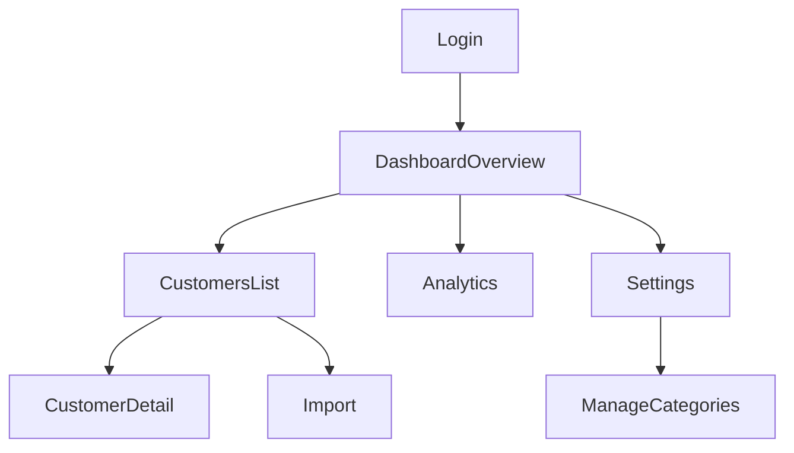

# UI 流程重構與 Next 16.1.1 全面升級計畫

## 現況快速盤點（已存在 vs 缺口）

- **已存在**
  - **登入/權限**：Credentials + Prisma User（`lib/auth.ts`），受保護區域目前靠 route group layout 檢查 session（`app/(dashboard)/layout.tsx`）。
  - **客戶管理**：Customers CRUD（`app/api/customers/route.ts`, `app/api/customers/[id]/route.ts`）。
  - **聯絡人/開發紀錄**：Contacts/Logs CRUD（`app/api/customers/[id]/contacts/*`, `app/api/customers/[id]/logs/*`）。
  - **批量模式**：批量更新等級、批量刪除（`components/batch/BatchToolbar.tsx`）。
  - **Excel 匯入**：`/api/import` + 匯入 modal（`app/api/import/route.ts`, `components/ImportModal.tsx`）。
  - **分析**：`/api/analytics` + 分析 modal（`app/api/analytics/route.ts`, `components/AnalysisModal.tsx`）。

- **明確缺口 / 需要重構或補齊**
  - **匯出功能未完成**：批量匯出目前只有占位提示「開發中」。（見 `components/batch/BatchToolbar.tsx`）
  - **分析月曆為硬編碼**：固定 `2023-12`、固定 31 天且假設 12/1 週五，需改為動態月份/正確 weekday 對齊。（見 `components/AnalysisModal.tsx`）
  - **類別來源不一致**：DB 有 `Category`，但 UI 的 categories 是硬編碼常數（`SearchFilter`、`AddCustomerModal`、`EditCustomerDrawer`）。需要「類別設定頁 + API」並統一使用資料庫來源。
  - **效能與資料量風險**：`GET /api/customers` 會 `include logs: true`（全量），客戶一多會很慢；需要「列表只取摘要/最新一筆 + 分頁/游標」與「詳情頁才取全量」。
  - **驗證/型別**：前端有 Zod schema（`lib/validations/customer`），但 API 端多以 `any` 接資料，需把 Zod 驗證搬到 API/Server Actions，避免髒資料。
  - **安全性與體驗**：登入頁顯示預設帳密、auth/登入流程有大量 console log（`app/login/page.tsx`, `lib/auth.ts`），需整理。

## UI/UX：重構為 App Shell 的新流程

- **資訊架構（多頁）**：
  - `/login`：登入
  - `/dashboard`：總覽（KPI、待回覆、最近活動、快捷新增）
  - `/customers`：客戶列表（搜尋/篩選/批量/匯入入口/匯出）
  - `/customers/[id]`：客戶詳情（基本資料、聯絡人、開發紀錄、下次聯繫/提醒）
  - `/analytics`：分析頁（取代 modal；可跨月份/區間）
  - `/import`：匯入頁（取代 modal；做「預覽/欄位映射/重複檢查/錯誤報告」）
  - `/settings/categories`：類別管理（新增/更名/合併/停用）

- **導覽/互動原則**：
  - 列表頁專注「找/篩/批量」；詳情頁專注「編輯與歷程」
  - Modal/Drawer 僅保留「快速新增紀錄/快速改等級/快速排程」，其餘改為頁面
  - 一致的 toast、空狀態、載入骨架（目前已有 `components/ui/*` 可延用）

- **建議的流程圖**：



## 核心套件升級：Next 16.1.1 + React 19 + 全相依更新（含 next-auth 遷移）

- **現況版本**：Next 14.2 / React 18.3（`package.json`）。
- **目標**：Next 16.1.1 + React 19.x（依 Next 16 要求），並同步更新 `eslint-config-next`、TypeScript typings、Prisma、Tailwind 等。
- **關鍵風險點**：
  - **React 19**：可能影響部分 client component、第三方套件相容性。
  - **next-auth v4**：需評估並大概率遷移到 v5（Auth.js）以符合新版 Next/App Router 的最佳實務；程式中有多處 `getServerSession`（layout + API）需要改寫。

## 會直接動到的關鍵檔案（高機率）

- 路由/版型：`app/(dashboard)/page.tsx`, `app/(dashboard)/layout.tsx`, `app/login/page.tsx`（將改為 `(auth)`、`(app)` route groups）
- Auth：`lib/auth.ts`, `app/api/auth/[...nextauth]/route.ts`
- Customers/Import/Analytics：`app/api/customers/**`, `app/api/import/route.ts`, `app/api/analytics/route.ts`
- UI 元件：`components/CustomerCard.tsx`, `components/SearchFilter.tsx`, `components/batch/BatchToolbar.tsx`, `components/AnalysisModal.tsx`, `components/ImportModal.tsx`
- 依賴：`package.json`, `package-lock.json`

## 先修的幾個「必改」線索（示例引用）

- **Next/React 目前版本**：
```15:19:/Users/bruce/Projects/iris_notes/package.json
  "dependencies": {
    "next": "^14.2.0",
    "react": "^18.3.0",
    "react-dom": "^18.3.0",
    "@prisma/client": "^5.22.0",
```

- **分析月曆硬編碼**：
```52:55:/Users/bruce/Projects/iris_notes/components/AnalysisModal.tsx
    // 生成當月日曆（假設12月有31天，從週五開始）
    const days = Array.from({ length: 31 }, (_, i) => i + 1);
    const monthPrefix = '2023-12-';
```

- **批量匯出未完成**：
```94:99:/Users/bruce/Projects/iris_notes/components/batch/BatchToolbar.tsx
  const handleBatchExport = () => {
    // 簡單的 CSV 匯出
    const csvContent = 'data:text/csv;charset=utf-8,公司名稱,產業類別,等級,地址,電話\n';
    // 這裡實際上應該從 API 獲取完整的客戶資料，目前只是示範
    showToast('匯出功能開發中...', 'info');
  };
```